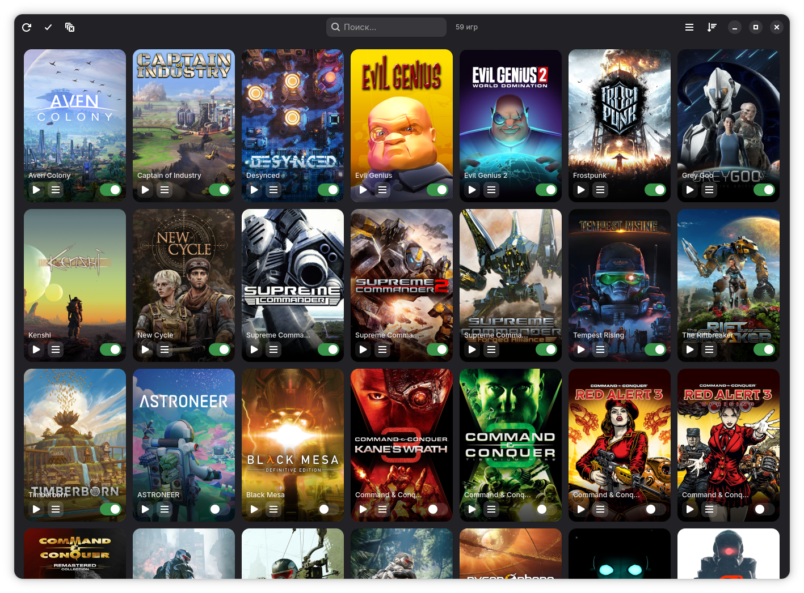
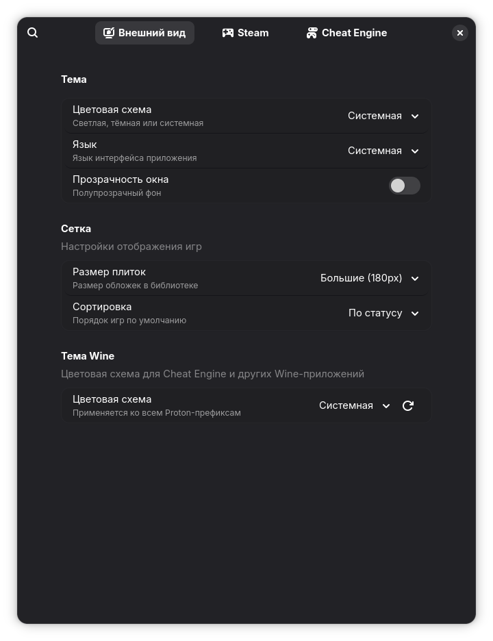
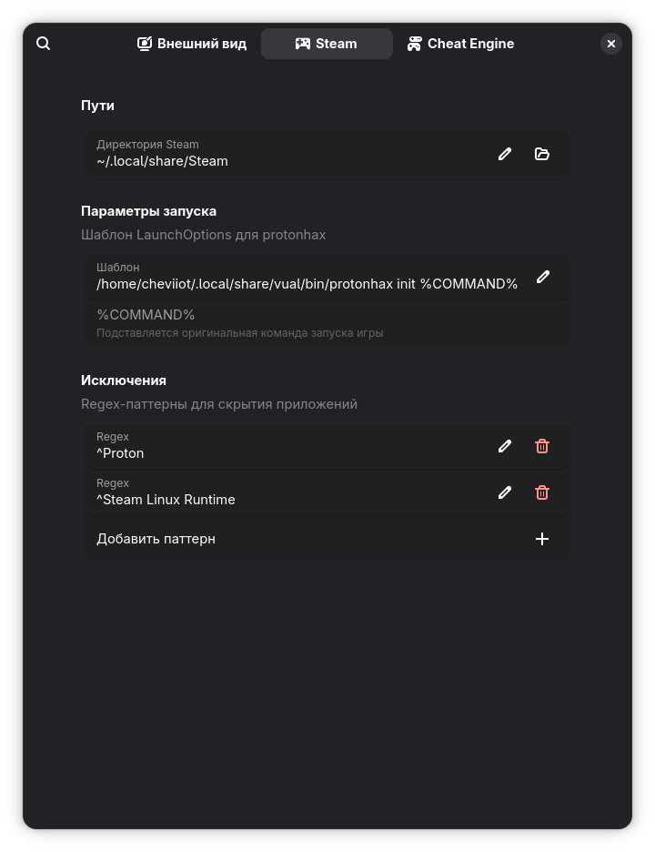
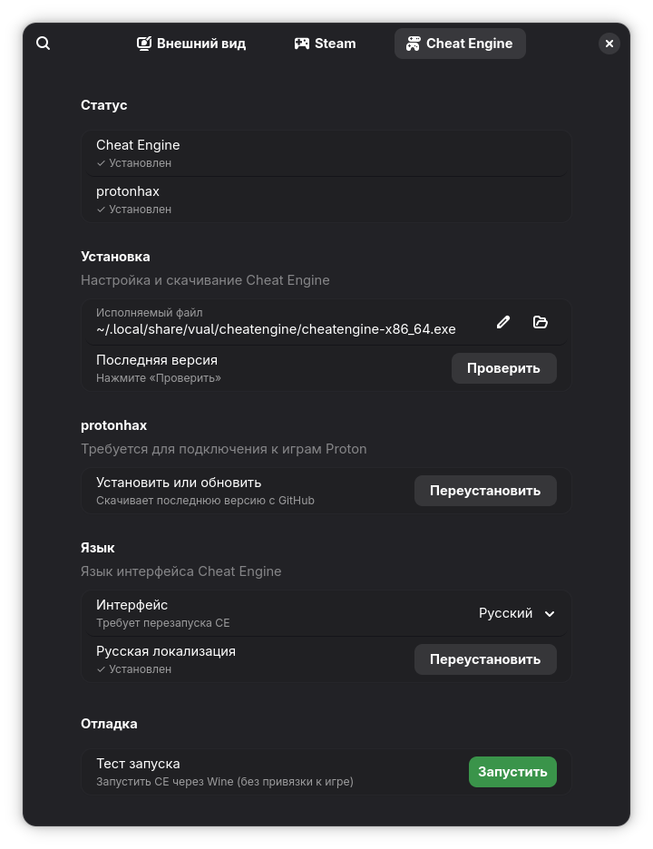

<p align="center">
  
</p>

<h1 align="center">Vual</h1>

<p align="center">
  Запуск Cheat Engine для Steam-игр через Proton
</p>

<p align="center">
  
  
  
  <a href="LICENSE"></a>
</p>


## О проекте

Vual — приложение для запуска [Cheat Engine](https://github.com/cheat-engine/cheat-engine) в Steam-играх, работающих через Proton.
Показывает библиотеку Steam, управляет [protonhax](https://github.com/jcnils/protonhax) и launch options, скачивает и
распаковывает CE автоматически, запускает его в нужном Wine-префиксе — всё из одного
окна.

## Возможности

- **Сетка игр** — обложки из Steam CDN, поиск в реальном времени, сортировка по имени или статусу
- **Запуск одним кликом** — игра стартует через Steam, CE подключается к нужному Proton-префиксу
- **Таблицы CE** — привязка .CT-файла к игре, автоматическое открытие вместе с CE
- **protonhax** — автоматическая установка, переключатель launch options для каждой игры, массовое вкл/выкл
- **Установка CE** — скачивание с cheatengine.org, распаковка через Wine из Proton
- **Тема Wine** — тёмная или светлая тема для всех Proton-префиксов разом
- **Локализация** — интерфейс EN/RU, язык CE, установка русской локализации из офиц. репозитория CE
- **Прозрачность окна** — полупрозрачный фон в стиле frosted glass
- **Гайд** — встроенная страница быстрого старта при первом запуске и из меню

## Скриншоты

<p align="center">
  
  
  
  
</p>

## Установка

### Stapler

```
stplr repo add luma https://github.com/Cheviiot/Luma.git
stplr refresh && stplr install vual
```

### Из исходников

```
git clone https://github.com/Cheviiot/vual.git
cd vual
./vual
```

<details>
<summary><strong>Зависимости</strong></summary>

| Дистрибутив      | Команда                                                                         |
|------------------|---------------------------------------------------------------------------------|
| ALT Linux        | `apt-get install python3-module-pygobject3 libgtk4 libadwaita python3-module-requests` |
| Fedora           | `dnf install python3-gobject gtk4 libadwaita python3-requests`                  |
| Arch             | `pacman -S python-gobject gtk4 libadwaita python-requests`                      |
| Debian / Ubuntu  | `apt install python3-gi gir1.2-gtk-4.0 gir1.2-adw-1 python3-requests`          |

Также нужен **Proton** (через Steam) — для распаковки CE и работы protonhax.

</details>

## Использование

### Перед началом

- Установи или скачай Cheat Engine в настройках
- Проверь, что путь к Steam указывает на правильную библиотеку
- Закрой Steam перед массовым изменением launch options

### Как работает Vual

| Шаг | | |
|---|---|---|
| **1** | **Выбери игру** | Найди игру в библиотеке и включи переключатель на её плитке |
| **2** | **Запусти через Steam** | Steam запустит игру с protonhax и подготовит нужное окружение |
| **3** | **Открой Cheat Engine** | Используй меню плитки, чтобы запустить CE для работающей игры |
| **4** | **Привяжи таблицу** | Привяжи .CT-файл один раз — Vual будет передавать его в CE автоматически |

### Полезно знать

- Поиск в заголовке быстро фильтрует большие библиотеки
- Кнопка меню на каждой плитке содержит действия CE и привязку таблиц
- Прозрачность окна включается в настройках внешнего вида

## Управление

| Действие           | Как                                     |
|--------------------|-----------------------------------------|
| Запуск CE          | Кнопка ▶ на плитке игры                 |
| Поиск              | Поле поиска в заголовке                 |
| Привязать таблицу  | Меню плитки → Привязать таблицу         |
| Вкл/выкл protonhax| Переключатель на плитке                 |
| Массовое вкл/выкл  | Включить все / Отключить все           |
| Сортировка         | Меню сортировки в заголовке             |
| Настройки          | ☰ → Настройки                          |
| Гайд               | ☰ → Гайд                               |

## Настройки

| Параметр           | Варианты                     | По умолчанию |
|--------------------|------------------------------|--------------|
| Тема               | Системная / Светлая / Тёмная | Системная    |
| Язык               | Авто / Английский / Русский  | Авто         |
| Размер плиток      | Маленький / Средний / Большой| Средний      |
| Сортировка         | По имени / По статусу        | По имени     |
| Прозрачность окна  | вкл / выкл                   | выкл         |
| Тема Wine          | Системная / Тёмная / Светлая | Системная    |
| Язык CE            | Системный / Русский          | Системный    |

## Данные

| Путь                              | Содержимое                          |
|-----------------------------------|-------------------------------------|
| `~/.config/vual/config.json`      | Настройки                           |
| `~/.local/share/vual/cheatengine/`| Cheat Engine                        |
| `~/.local/share/vual/bin/protonhax`| protonhax                          |
| `~/.local/share/vual/tables/`     | .CT-таблицы и привязки              |
| `~/.local/share/vual/wine_prefix/`| Wine-префикс для тестового запуска  |
| `~/.cache/vual/covers/`           | Кэш обложек Steam                  |

## Участие в разработке

> Это личный проект. Vual создаётся одним человеком для собственного использования при помощи ИИ.

Код полностью открыт. Если хотите помочь — Pull Request и Issue приветствуются:
исправление ошибок, новые функции, переводы.

## Лицензия

[GPL-3.0-or-later](LICENSE)
